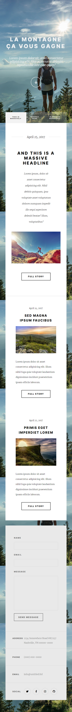

<p align="center">
<a href=https://github.com/sunsand03/integration_la_montagne target="_blank">

</a>
</p>


<p align="center">


</p>

<p></p>
<p></p>

## 🔍 Table of Contents

* [💻 Stack](#stack)

* [📝 Project Summary](#project-summary)

* [🚀 Run Locally](#run-locally)

* [🙌 Contributors](#contributors)


## 💻 Stack

Showcase website built with **HTML** and **SCSS**.
* The desktop version :


* The mobile version :


## 📝 Project Summary

- [**assets**](assets): Main directory for project assets.
- [**assets/fonts**](assets/fonts): Directory for storing font files.
- [**assets/images**](assets/images): Directory for storing image files.
- [**assets/sketch**](assets/sketch): Directory for storing sketch files.
- [**assets/styles**](assets/styles): Directory for CSS and SCSS stylesheets.
- [**assets/styles/layouts**](assets/styles/layouts): Directory for layout-specific SCSS stylesheets.


## 🚀 Run Locally
1.Clone the integration_la_montagne repository:
```sh
git clone https://github.com/sunsand03/integration_la_montagne
```


## 🙌 Contributors

<table style="border:1px solid #404040;text-align:center;width:100%">
<tr><td style="width:14.29%;border:1px solid #404040;">
        <a href="https://github.com/sunsand03" spellcheck="false">
          
          <br />
          <b>sunsand03</b>
        </a>
        <br />
        <a href="https://github.com/sunsand03/integration_la_montagne/commits?author=sunsand03" title="Contributions" spellcheck="false">
          18 contributions
        </a>
      </td></table>


